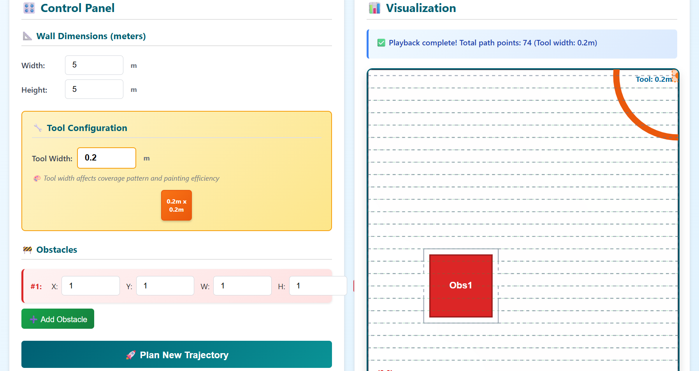

# Wall-Finishing Robot Control System

Path planning software for autonomous wall-finishing robots. Generates optimal trajectories while avoiding obstacles.

## Features

- Sweep-line path generation with obstacle avoidance
- Real-time trajectory visualization
- Coverage area and efficiency calculations
- Trajectory storage and replay
- Configurable tool widths and safety margins

## How It Works

The system divides walls into horizontal strips and plans efficient back-and-forth patterns. When obstacles are encountered, the robot navigates around them using calculated safety margins.

**Input**: Wall dimensions, obstacle positions, tool specifications  
**Output**: Complete robot trajectory with waypoints and metrics

## Technical Details

### Path Planning Algorithm
1. Calculate sweep lines based on tool width
2. Identify obstacle-free segments on each line
3. Generate continuous path connecting all segments
4. Apply safety margins around obstacles
5. Optimize for minimum travel distance

### Safety System
- Obstacles expanded by tool radius plus clearance buffer
- Collision detection for all planned movements
- Minimum gap width validation
- Path continuity verification

### Metrics
- Coverage area (m²)
- Total path length (m)
- Coverage efficiency (%)
- Estimated completion time

## API Endpoints

```
POST /plan-trajectory/     # Generate new trajectory
GET  /trajectories/        # List all trajectories  
GET  /trajectories/{id}    # Get specific trajectory
GET  /trajectories/{id}/metrics  # Get detailed metrics
```

## Configuration

Wall dimensions: 0.1-50m width, 0.1-20m height  
Tool width: 0.05-1.0m  
Obstacles: Up to 20 per wall  
Safety clearance: Configurable, default 5cm

## Usage



1. Define wall dimensions and obstacles
2. Set tool width and safety parameters
3. Generate trajectory using planning algorithm
4. Review path visualization and metrics
5. Execute or store for later use

## Dependencies

- FastAPI (web framework)
- SQLAlchemy (database)
- Pydantic (data validation)
- SQLite (storage)

Built for industrial painting, coating, and surface treatment applications.

## Installation & Setup

### Prerequisites
- Python 3.8 or higher
- pip package manager

### Install Dependencies
```bash
pip install -r requirements.txt
```

### Start the Application
```bash
uvicorn app:app
```

The server will start on `http://localhost:8000`

### Access the Interface
Open your browser and navigate to:
```
http://localhost:8000
```

The web interface will load automatically from the `/frontend` directory.

